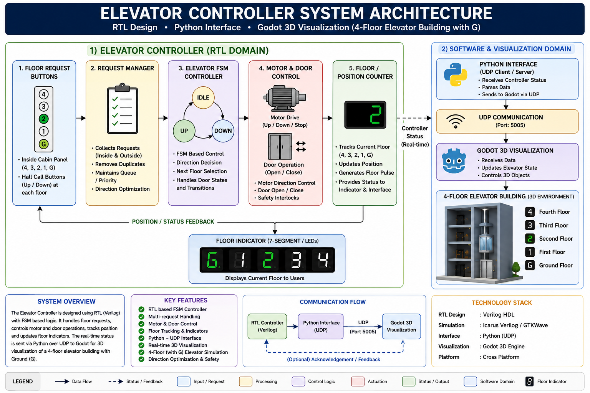
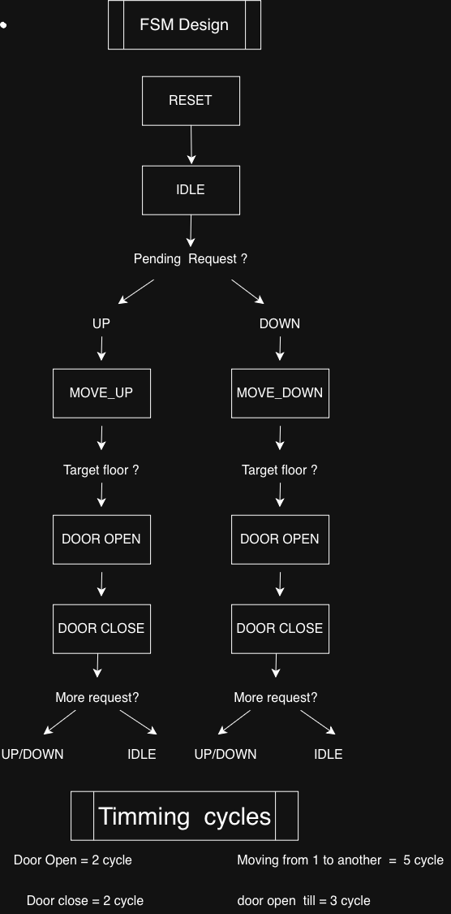
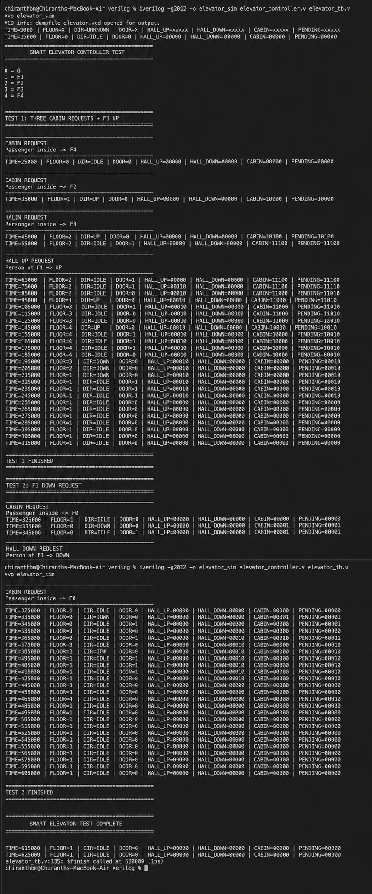
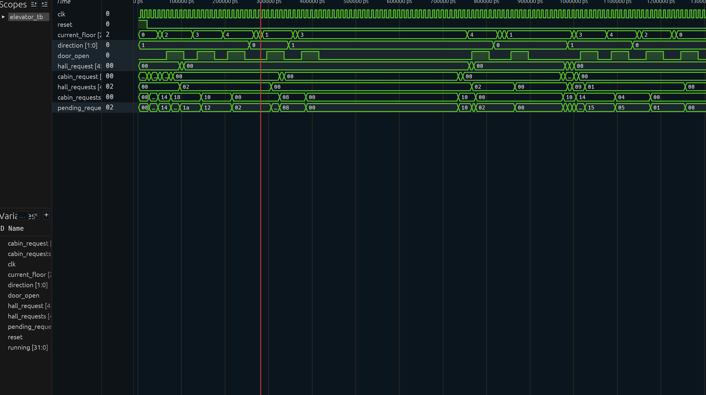
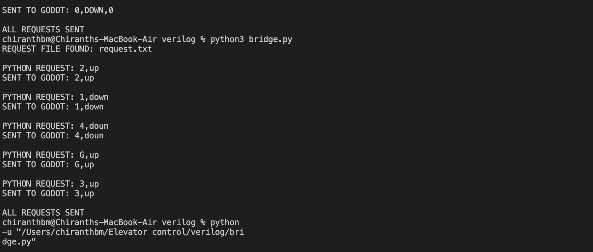
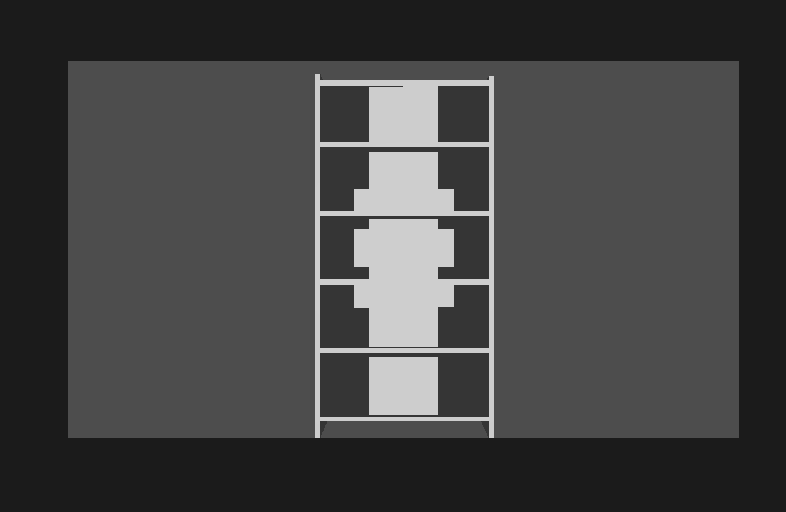
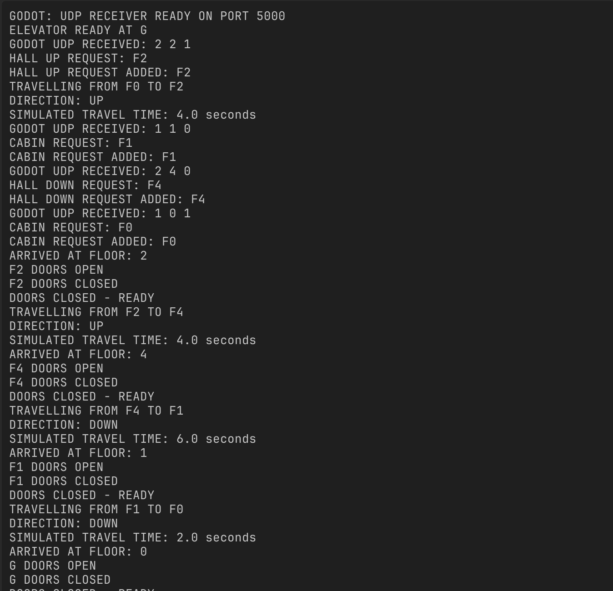

# Elevator Control System
A digital elevator control system designed using Verilog HDL, verified through simulation, connected to a Python UDP interface,and visualized using Godot 3D 
## 1.      Abstract

this project implements an automated elevator control system for a four floor building consisting of Ground(G),F1,F2,F3,F4.

The main elevator control logic is designed in Verilog HDL using a finate state machine(FSM). The controller manages both cabin requests and hall requests , with separate handling for upward and downward hall requests.  

The controller uses direction-based scheduling. When the elevator is travelling in one direction, it continues serving requests in that direction before reversing,while also accepting new requests that arrive during operation.

The verilog design is tested using a dedicated testbench and simulated using Icarus Verilog. The resulting waveforms are examined for functional verification.

A Python interface reads elevator requests from a request file and communicates with the Godot simulation through UDP. Godot 3D provides a visual representation of the elevator system.

in the Godot simulation, the elevator cabin remains stationary and elevator travel is represented through a time-based simulation. When the simulated elevator reaches a requested floor, the corresponding floor doors open, remain open for a defined period, and then close before the continues with the remaining requests.

The project demonstrates the integration of digital design, FSM-based control, simulation, verification, Python networking, and 3D visualization into one complete elevator control system.

---

##  2.     Project Objectives

- Design an elevator controller using verilog HDL
- Implement the elevator control logic using an FSM
- Support five floors: G,F1,F2,F3 and F4.
- Support cabin requests.
- Support hall UP and DOWN requests.
- Implement direction-based request scheduling.
- Store and process multiple pending requests.
- Verify the RTL using a Verilog testbench.
- Simulate the design using Icarus Verilog.
- Verify the controller using simulation waveforms 
- Develop a Python interface for request transmission.
- Establish UDP communication between Python and Godot.
- Create a 3D visualization of the elevator operation using Godot.
- Demonstrate the complete hardware-to-visualization workflow.

---

## 3. Problem Specification

An elevator control system must accept requests from both passengers inside the elevator and passengers waiting at different floors.

The controller must:

- Identify the requested floor.
- Distinguish between cabin and hall requests.
- Handle hall UP and DOWN requests.
- Maintain multiple pending requests.
- Select an appropriate direction.
- Continue serving requests in the current direction when possible.
- Reverse direction when required.
- Open the appropriate floor doors.
- Close the doors after a defined time.
- Return to the idle state when there are no pending requests.

The project implements these requirements using a digital FSM-based controller and a software visualization interface.

---

##  4.    Floor Configuration

| Floor Number | Floor Name |
|---:|---|
| 0 | Ground (G) |
| 1 | F1 |
| 2 | F2 |
| 3 | F3 |
| 4 | F4 |

---

## 5. System Architecture



```text
        ELEVATOR CONTROL SYSTEM

            User Requests
                  |
                  v
         +-----------------+
         |   Verilog RTL   |
         | FSM Controller  |
         +--------+--------+
                  |
                  v
               Testbench
                  |
                  v
             Icarus Verilog
                  |
                  v
          Waveform Verification
                  |
                  v
             Python Interface
                  |
                  | UDP
                  v
                Godot 3D
                  |
                  v
          Floor Door Simulation

```

# Major Components

### Verilog Controller

The Verilog Controller is the main digital control unit.it maintains:
-Current floor
-Direction
-Door status
-Hall UP requests
-Hall DOWN requests
-Cabin requests
-pending requests

### Testbench
The testbench provides diffrent elevator request combinations and observes the controller outputs.

### Icarus Verilog
Icarus verilog is used to compile and simulate the Verilog RTL and testbench

### Waveform Verification
Simulation waveform are examined to verify floor movement, direction changes, door operation, and request handling.

### Python Interface
Python reads requests from request.txt and sends them to Godot through UDP

### Godot 3D
Godot receives the requests and provides a visual representation of the elevator operation

## 6. FSM Design

The elevator controller is based on a finite state machine.



The main operational states are:

- **IDLE** – Waits for elevator requests.
- **MOVING** – Moves toward the requested floor.
- **DOOR OPEN** – Opens the doors when the destination is reached.
- **DOOR WAIT** – Keeps the doors open for the specified time.
- **DOOR CLOSE** – Closes the doors before servicing the next request.

The controller then returns to **IDLE** or continues toward another pending request.
## 7. Direction Control
The controller uses three direction values:

|STATE|BC|
|---:|---|
| DOWN | =00 |
| UP | =01 |
| IDLE | =10 |

## UP Operation
When travelling UP:
1. Check for requests above the current floor.
2. Continue upward if a request exists.
3. If there are no requests above but requests exist below, reverse to DOWN.
4. If there are no requests anywhere, return to IDLE

## DOWN Operation
When travelling DOWN:
1. Check for requests below the current floor.
2. Continue downward if a request exists.
3. if there are no requests below but requests exist above, reverse to UP.
4. if there are no requests anywhere, return to IDLE

## IDLE Operation
When IDLE:
1. Check for requests above.
2. if one exists, travel UP.
3. Otherwise check for requests below.
4. If one exists, travel DOWN
5. Otherwise remain IDLE

## 8. Request Management

The controller maintains Three seprate request sets:

```text
hall_up_requests
hall_down_requests
cabin_requests
```
The overall pending request signal is

```text
pending_requests =
    hall_up_requests |
    hall_down_requests |
    cabin_requests
```
A request at the current floor is given priority so that the appropriate floor doors can be opened immediately

When a floor is served, all request types associated with that floor are cleared. 

## 9. Timing Specification

The system uses the following timing:

```text
Travel time per floor = 2 seconds
Door open duration    = 2 seconds
```

For example,travelling from G to F3 is represented as:

```text
G -> F1 -> F2 -> F3

3 floors x 2 seconds = 6 seconds simulated travel time
```

The Physical elevator cabin does not move vertically in the Godot visualization

Insted, elevator travel is represented using a timer. When the simulated destination is reached, the corresponding floor doors are operated.

## 10. Verilog RTL Implementation

The main RTL module is:
```text
elevator_controller.v
```
The top-level module is:

```bash
</> verilog
module elevator_top
```
## Inputs
```text
clk
reset
hall_up_request
hall_down_request
cabin_request
```
## Outputs
```text
current_floor
direction
door_open
hall_up_requests
hall_down_requests
cabin_requests
pending_requests
```
## Floor Representation
The five floors are represented using 5-bit request registers:

```text
Bit 0 -> G
Bit 1 -> F1
Bit 2 -> F2
Bit 3 -> F3
Bit 4 -> F4
```

## 11.Testbench and Verification
A dedicated Verilog testbench is used to verify the elevator controller:

The testbench checks:
- Reset behavior
- Initial elevator position
- Cabin requests
- Hall UP requests
- Hall DOWN requests
- Multiple pending requests
- Direction changes
- Floor servicing
- Door opening
- Door closing
- Request clearing
- Idle behavior

The design was simulated using Icarus Verilog

## 12.Icarus Verilog Simulation



Icarus Verilog is used to compile and simulate the Verilog elevator controller and its testbench.

### compilation

The verilog design and testbench are compiled using:

```bash
</> Bash
iverilog -g2012 -0 elevator_sim elevator_conntroller.v elevator_tb.v
```
The simulation can then be excecuted using:
```Bash
</>Bash
vvp elevator_sim
```
The simulation output provides information such as:
```text
TIME
FLOOR
DIRECTION
DOOR
HALL REQUESTS
CABIN REQUESTS
PENDING REQUESTS
```
This allows the controller's behavior to be observed during simulation.

## 13. Waveform Verification


The generated simulation waveform is used to verify the relationship between:
- Clock
- Reset
- Current floor
- Direction
- Door status
- Hall requests
- Cabin requests
- Pending requests

The waveform verification confirms that the controller responds to requests and changes its operating state according to the designed control logic.

## Python Interface




The Python program acts as the communication bridge between the requests file and Godot.

## Main file:
```text
bridge.pyV
```
The Python interface:
1. Reads request.txt
2. Validates each request.
3. Sends the request through UDP
4. Uses localhost communication
5. Sends dats to UDP port 5000.
communication flow:
```text
 request.txt
       |
       V
   bridge.py
       |
       | UDP
       v
     Godot
```

## Request Format
The request file uses:
```text
TYPE FLOOR DIRECTION
```
### REQUEST TYPES
```text
1 = CABIN
2 = HALL
```
### Direction
```text
1 = UP
0 = DOWN
```
For cabin requests, the direction values is ignored

## 16. Godot 3D Simulation
The visualization is developed using Godot Engine

The Godot simulation includes:

- Ground floor
- F1
- F2
- F3
- F4
- Floor doors
- Automatic door opening
- Automatic door closing
- Simulated elevator travel
- Request scheduling
- UDP request reception




The elevator cabin remains stationary.

Insted of physically moving the cabin between floors, the system travel using a timer and operates the doors corresponding to the simulated destination floor.

## 17.Godot UDP Communication




Godot listens for incoming UDP packets on:
```text
IP   : 127.0.0.1
Port : 5000
```
Godot interprets this as:
```text
Hall request
Floor = F3
Direction = UP
```
The request is then added to the appropriate request queue.

## 18. Automatic Scheduling
The Godot simulation follows the same genral direction-based scheduling concept as the verilog controller.

The system can continue upward while requests remain above:
```text
G -> F1 -> F2 -> F3 -> F4
```
At each requested floor, the coresponding doors are operated.
When no further requests remain in the current directiion, the controller reverses if required.

Requests arriving while the elevator is travelling are stored and considered by the scheduler.

## 19.Door Operation:
At a simullated destination:
```text
Arrive at floor
       |
       v
Open floor doors 
       |
       v
Wait 2 seconds
       |
       v
Close floor doors
       |
       v
Check pending requests
       |
       v
Continue / Reverse / Idle
```

Each floor has its own door controller:
```text
G_Doors
F1_Doors
F2_Doors
F3_Doors
F4_Doors
```
 
## 20. Complete System Integration

### System Demonstration

The following video demonstrates the complete elevator control system, including request handling, scheduling, simulated elevator operation, and door control.

[▶️ Watch Elevator System Demonstration](./vedios/system_integration.mp4)

The complete project flow is:
```text
              REQUEST
                 |
                 |
                 v
            request.txt   
                 |
                 |
                 v
           bridge.py(Python)
                 |
                 |UDP
                 v
              Godot 3D
                 |
                 |
                 v
         Request Processing
                 |
                 |
                 V
         Direction Scheduler
                 |
                 |
                 V
          Floor Simulation
                 |
                 |
                 V
            Door control   
```
The verilog controller is independently veriified through simulation, while Python and Godot provide the software interface and visualization layer.

## 21. Example End-to-End operation

Example requests:
```text
2 3 1 
2 4 0
1 2 0
1 1 1
2 0 0
The system receives multiple requests and stores them

A possible service sequence begins by moving upward:
```text
G
|
v
F1
|
V
F2
|
V
F3
|
V
F4
```
At each required destination, the corresponding floor doors are opened and closed.

when no further requests remain in the current direction, the controller reverses if required.

Finally, when all requests are serviced:

```text
System -> IDLE
```
## 22. Results

The completed project successfully demonstrates:

- Five-floor elevator control.
- Cabin request handling.
- Hall UP request handling.
- Hall DOWN request handling.
- Multiple pending requests.
- Direction-based scheduling.
- Request storage during operation.
- Door control.
- Verilog RTL simulation.
- Testbench-based verification.
- Waveform verification.
- Python request transmission.
- UDP communication.
- Godot 3D visualization.
- Automatic floor door operation.

The project demonstrates a complete hardware-control and software-visualization workflow.

## 23. Advantages

- Modular design.
- FSM-based digital control.
- Supports multiple request types.
- Handles multiple pending requests.
- Direction-based scheduling.
- Hardware logic can be independently simulated and verified.
- Python provides a simple communication interface.
- Godot provides an interactive visualization.
- The architecture can be extended to additional floors and features.

## 24. Future Scope

The project can be extended by adding:
- Physical elevator motor control.
- FPGA implementation.
- Real push-button inputs.
- Floor position sensors.
- Motor driver interfaces.
- Emergency stop functionality.
- Overload detection.
- Door obstruction detection.
- Seven-segment or LCD floor display.
- Real-time hardware-to-Godot communication.
- More advanced elevator scheduling algorithms.
- Multi-elevator coordination.
- IoT-based monitoring.

## 25.Technologies Used
|Technology|Purpose|
|---:|---|
|Verilog HDL|Elevator controller design|
|FSM|control logic|
|Icarus Verilog|RTL simulation|
|Waveform Viewer|Functional verificaation|
|Python|communication bridge|
|UDP|Data communication|
|Godot Engine|3D visualization|
|Git/GitHub|Version control and project hasting|

## 26. Conclusion

This project successfully implements and demonstrates an elevator control system using a combination of hardware description language, simulation, software communication, and 3D visualization.

The Verilog controller provides the core digital control logic and is verified through simulation and waveform analysis. The Python interface provides communication between the request source and the visualization system, while Godot 3D demonstrates the elevator's operation through simulated travel and automatic floor-door control.

The project provides practical experience in digital system design, FSM development, RTL verification, simulation, Python networking, UDP communication, and 3D system visualization.

It also establishes a foundation that can be extended toward FPGA implementation and physical elevator control systems.